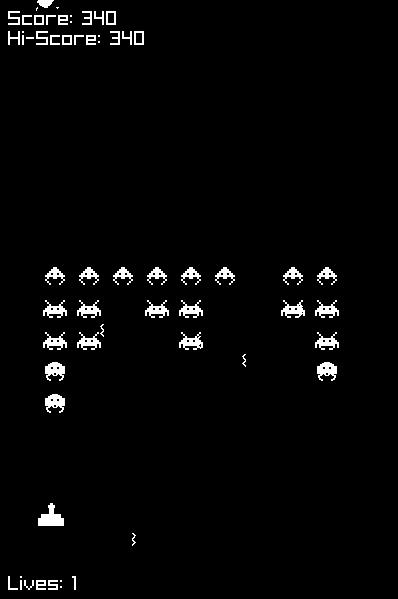
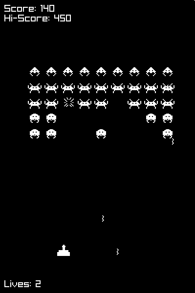

# 🕹️ Space Invaders Remake using raylib

A personal project recreating the arcade classic **Space Invaders**, built from scratch using **C++** and **raylib**. This game features an Entity-Component-System (ECS) architecture.

---

## 📸 Screenshots

<p align="center">
  
  
</p>

---

## 🚀 Features

- ECS architecture for modularity and flexibility
- Player and enemy movement with shooting logic
- Collision detection
- Score tracking and UI 
- Game state management (playing, paused, game over)
- Cross-platform build support (Windows & Linux)

---

## 🛠️ Build Instructions

### ✅ Prerequisites
- **CMake** (>= 3.5)
- **Git**
- **raylib** (fetched automatically)
- A C++ compiler:
  - Windows: MSVC or MinGW
  - Linux: g++ (with OpenGL, X11, and pthreads)

---

### 🧰 Build (Windows & Linux)

```bash
git clone https://github.com/manumg35/SpaceInvaders-Remake-With-Raylib.git
cd SpaceInvaders-Remake-With-Raylib
cmake -Bbuild -DCMAKE_BUILD_TYPE=Release
cmake --build build
